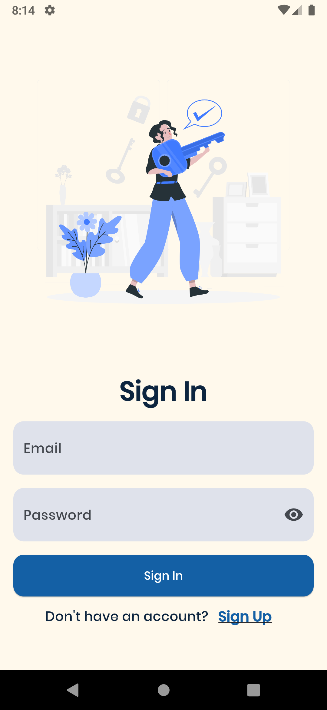
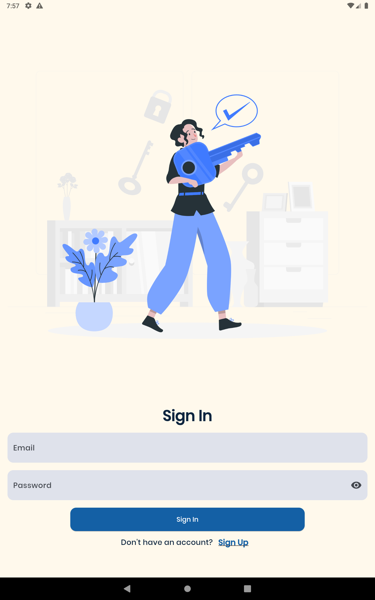
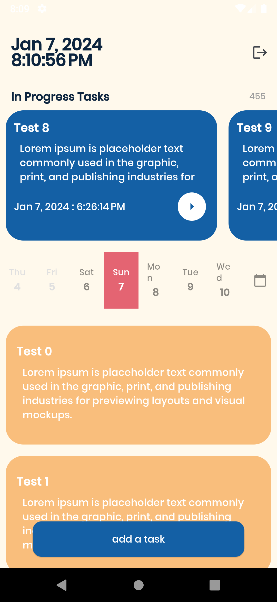
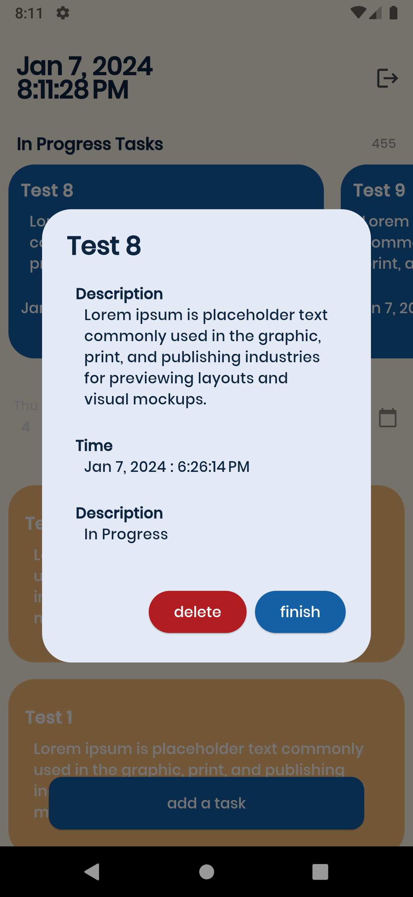
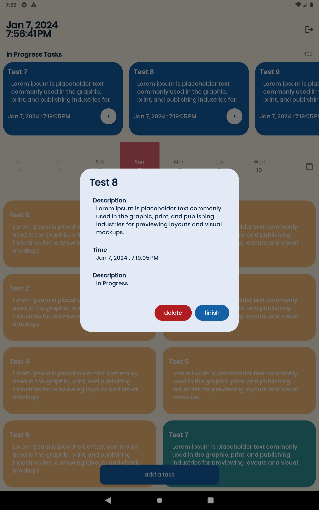
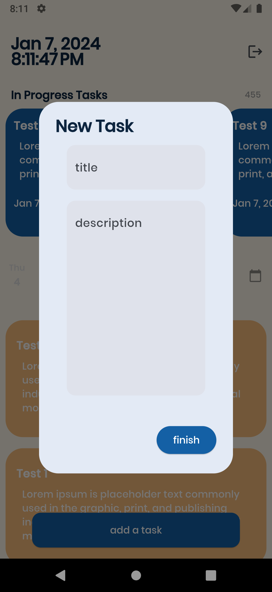
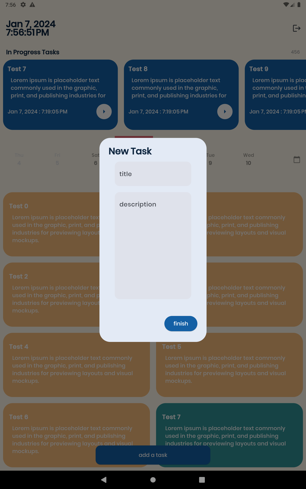

<h1 align="center">Task Management</h1>

<h3>About</h3>

is a task managing application to help its users to stay organized for their day to day activities.
 

can be used by android and ios

<h3>Packages</h3>
- flutter_app_name
- flutter_launcher_icons
- sqflite
- get
- intl
- horizontal_calendar

| Mobile  | Tablet |
| :---: | :---: |
|   |   |
|   |   |
|   |   |
|   |   |
